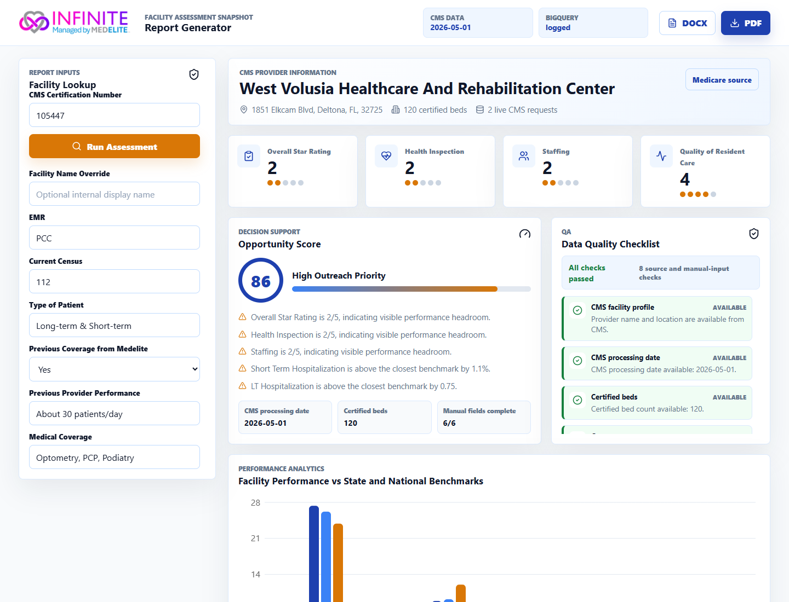
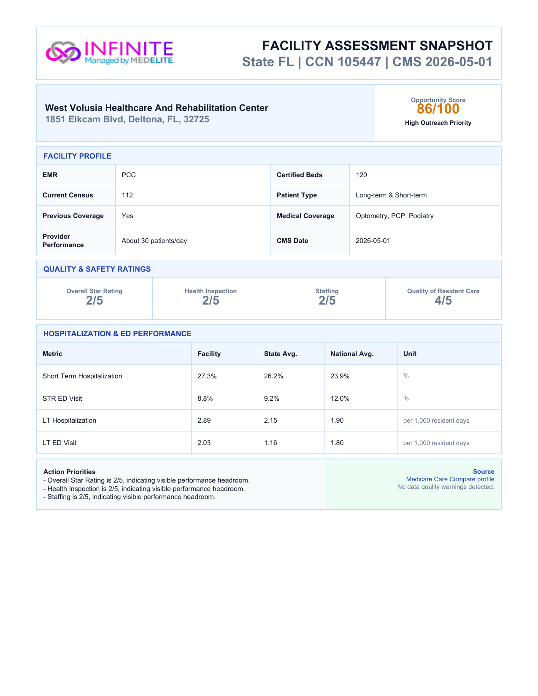

# Medelite Facility Assessment Report Generator

End-to-end technical case study implementation for the Medelite Healthcare Data
Automation & QA Analytics Internship.

The app fetches live CMS nursing home data by CCN, combines it with internal
manual operational inputs, visualizes facility-vs-benchmark performance, and
exports polished PDF/DOCX facility assessment reports.

## Recruiter Quick View

Live demo:

https://medelite-facility-assessment-326422085032.europe-west1.run.app/

This project demonstrates a complete healthcare data workflow: live CMS lookup,
manual facility context capture, benchmark analytics, data quality checks, and
client-ready report export.

### App Dashboard

The dashboard lets a user enter a CMS Certification Number, add operational
context, and generate a facility assessment with star ratings, opportunity
scoring, benchmark charts, and QA checks.



### PDF Export

The app exports a polished facility assessment snapshot that can be shared with
stakeholders or used as a recruiting case-study artifact.



## Features

- Dynamic CCN lookup against CMS Provider Data Catalog.
- Facility name override while preserving static `INFINITE - Managed by MEDELITE`
  platform branding.
- Manual operational inputs for EMR, census, patient type, Medelite history,
  provider performance, and medical coverage.
- All required star-rating fields from CMS Provider Information.
- Bonus hospitalization/ED metric mapping from CMS claims data.
- Bonus Facility vs State vs National grouped chart.
- Bonus editable DOCX export.
- Advanced error handling for invalid CCNs, missing CMS data, API timeouts, and
  incomplete metrics.
- Optional BigQuery audit logging for assessment runs.
- Single-container deployment pattern for Google Cloud Run.

## Data Sources

- Provider Information: `4pq5-n9py`
- Medicare Claims Quality Measures: `ijh5-nb2v`
- State/US Averages: `xcdc-v8bm`

CMS endpoint base:

```text
https://data.cms.gov/provider-data/api/1/datastore/query/{dataset_id}/0
```

## Important Assumptions

- The app uses live CMS data. Values for the sample CCN `686123` may differ from
  the provided Kendall Lakes PDF because CMS refreshes monthly.
- CCN is handled as a six-character string to preserve leading zeros.
- CMS calls happen server-side to avoid browser CORS limitations and reduce
  request volume.
- Results are cached briefly in memory and queried narrowly by CCN/state.
- BigQuery is optional. If credentials or table settings are missing, the app
  still works and records a local no-op logging status.

## Local Development

Backend:

```powershell
python -m venv .venv
.\\.venv\\Scripts\\python -m pip install -r backend\\requirements.txt
.\\.venv\\Scripts\\python -m uvicorn app.main:app --reload --app-dir backend --port 8000
```

Frontend:

```powershell
cd frontend
pnpm install
pnpm dev
```

The frontend dev server proxies `/api` requests to `http://localhost:8000`.

## Environment

Copy `.env.example` to `.env` for local backend settings.

BigQuery logging is enabled only when all of these are set:

```text
BIGQUERY_ENABLED=true
GCP_PROJECT_ID=your-project
BIGQUERY_DATASET=medelite_case
BIGQUERY_TABLE=facility_assessment_runs
GOOGLE_APPLICATION_CREDENTIALS=path-to-service-account.json
```

For Cloud Run, do not upload service-account JSON. Use the deployed service
account and configure BigQuery from Cloud Shell:

```bash
bash scripts/setup_bigquery_cloudrun.sh
```

Optional overrides:

```bash
REGION=europe-west1 SERVICE=medelite-facility-assessment bash scripts/setup_bigquery_cloudrun.sh
```

## Google Cloud Run

The included `Dockerfile` builds the React frontend and serves it through
FastAPI, so Cloud Run needs only one service.

```powershell
gcloud run deploy medelite-facility-assessment `
  --source . `
  --region europe-west1 `
  --allow-unauthenticated
```

## Validation Target

Use sample CCN:

```text
686123
```

Expected dynamic Medicare source link:

```text
https://www.medicare.gov/care-compare/details/nursing-home/686123/view-all?state=FL
```
